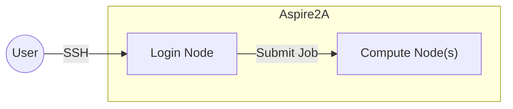
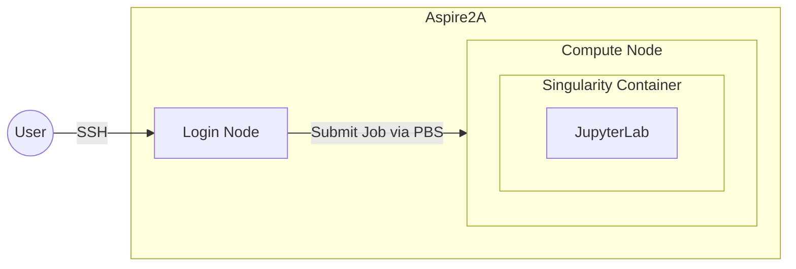
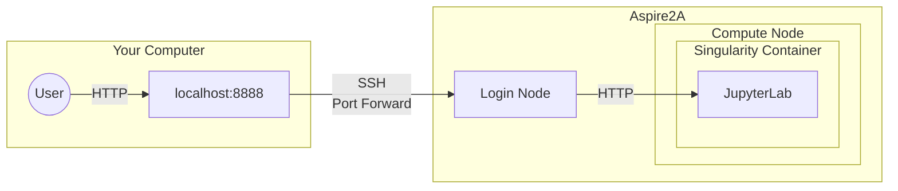

# NTUHPC Workshop: Accelerating ML Workflows with Aspire2A

Training Machine learning (ML) models require substantial computational power, especially when dealing with large datasets and complex architectures. High-performance computing (HPC) systems like the [NSCC's Aspire2A Supercomputer](https://www.nscc.sg/aspire-2a/) provide the necessary resources to accelerate ML workflows, reducing training times.

In this workshop we will explore the use of the Aspire2A's GPUs to accelerate fine tuning of YOLOv11 to classify images in the [Rock-Paper-Scissors Dataset](https://universe.roboflow.com/roboflow-58fyf/rock-paper-scissors-sxsw/dataset/14).

# Access Aspire2A

To access Aspire2A we first register a NSCC user account, then connect to Aspire2A via SSH.

## Setup NSCC User Account

To access Aspire2A, follow these steps to set up your NSCC user account:

1. Ensure you are on the NTU network (ie. connected on `NTUSecure`):

   > Outside of NTU? You must first connect to the NTU network [VPN](https://vpngate-student.ntu.edu.sg/global-protect/getsoftwarepage.esp)
   > and then connect to [Aspire2A via Jumphost (NTU Intranet Page)](https://entuedu.sharepoint.com/teams/ntuhpcusersgroup2/SitePages/Using-NTU-JumpHost-to-NSCC-ASPIRE-2A.aspx).
   > Exactly how to do this is left as an exercise for the reader.

2. Going to [NSCC Users Page](https://user.nscc.sg/saml/) to register for Aspire2A access.
3. Set a password for your user account by [Following the NSCC Entrollment guide](https://help.nscc.sg/wp-content/uploads/2024/05/NSCC-UserEnrollmentGuide-v0.1.pdf)

   > Optional: Download a SSH key for passwordless access. Learning how the SSH key for passwordless access is left as an exercise for the reader.

## Connecting to Aspire2A via SSH

Accessing the Aspire2A supercomputer requires using SSH: PUTTY on Windows & `ssh` command on Mac / Linux.

### Windows (Using PuTTY)

Connect to Aspire2A using PuTTY:

1. **Install PuTTY**

   - Download and install [PuTTY](https://www.chiark.greenend.org.uk/~sgtatham/putty/latest.html).

2. **Configure PuTTY**

   - Open _PuTTY_ and enter:
     - **Host Name**: `<USERNAME>@aspire2antu.nscc.sg`
       - Replace `USERNAME` with your Aspire2A username.
     - **Port**: `22`
     - **Connection Type**: `SSH`

3. **Connect**
   - Click _Open_ and enter your password when prompted.
   - If prompted to `continue connecting (yes / no)?` , type `yes` and press _Enter_.

Have a look at this [PuTTY guide > Simple Password-Based Login](https://www.lrz.de/services/compute/courses/x_lecturenotes/191007_PuTTY_Tutorial_2019.pdf) for screenshots and more guidance.

### Mac & Linux (Using Terminal)

Connect to Aspire2A via `ssh`

1. **Open Terminal**
2. **Run SSH Command**

   ```sh
   ssh <USERNAME>@aspire2antu.nscc.sg
   ```

   - Replace `<USERNAME>` with your Aspire2A username.

3. **Accept the Host Key (First-Time Login)**

   - If prompted to `continue connecting (yes / no)?` , type `yes` and press _Enter_.

4. **Enter Password**
   - Enter your password when prompted

## Checking Personal Project Quota

Aspire2A usage is billed via Service Unit (SU)s:

- **CPU** 1 SU / cpu core / hr.
- **GPU** 64 SU / gpu card / hr.

NTU students get a **1-time** grant of 100k SUs in their personal project with ID: `personal-<USERNAME>`

Check the SUs available in your projects by running:

```sh
myprojects
```

For more information, take a look at the [Aspire2A Introductory PPT](https://help.nscc.sg/wp-content/uploads/ASPIRE2A-INTRODUCTORY-WORKSHOP-THEORY-GUIDE.pdf)

# Running Jobs on Aspire2A

By connecting to Aspire2A via SSH, we are remotely connected to a Login Node.
To actually utilise Aspire2A's compute resources, we have submit a Job via the PBS Job System



## Staring a Jupyter Notebook Environment



To starting a Jupyter Notebook environment on Aspire2A, we spin up Singularity Container
running JupyterLab on one of the compute nodes by submitting a PBS Job Script.

1. **Inspect PBS Job Script**
   Study the [PBS Job Script](https://github.com/mrzzy/ntuhpc-workshops/blob/main/ml_aspire2a/jupyter_pytorch.sh) to
   understand how jobs are submitted to PBS. Here are the key points:

   - **Job Name**: Use `#PBS -N jupyterlab` to specify the job name.
   - **Queue**: Submit the `normal` queue using `#PBS -q normal`.
   - **Compute Resource Requests**:
     - `#PBS -l select=1:ncpus=2:ngpus=1:mem=16gb` (4 CPU, 1 GPU, 16 GB RAM).
     - `#PBS -l walltime=1:00:00` to request 1 hour of runtime.
   - **Project Billing**: Use `#PBS -P personal` to specify the your personal project quota for billing of resources used.
   - **Load Singularity**: Use `module load singularity` to load the Singularity container runtime.
   - **Start JupyterLab**: Run JupyterLab Pytouch container with GPU support using `singularity exec --nv`.

2. **Downlaod PBS Job Script**
   Download the PBS Job Script on Aspire2A

   ```sh
   curl -O https://raw.githubusercontent.com/mrzzy/ntuhpc-workshops/refs/heads/main/ml_aspire2a/jupyter_pytorch.sh
   ```

3. **Submit the Job**
   Use the `qsub` command to submit the job to the PBS queue. This will submit the `jupyter_pytorch.sh` job script to Aspire2A.

   ```sh
   qsub jupyter_pytorch.sh
   ```

4. **Check Job Status**
   After submission, you can check the status of your job using:
   ```sh
   qstat
   ```

For more information on the PBS Job system, take a look at the [Aspire2A Advanced Job Management Guide](https://help.nscc.sg/wp-content/uploads/ASPIRE2A-ADVANCED-JOB-MANAGEMENT-TRAINING_GUIDE.pdf)

## Connecting to Your JupyterLab

To connect to the JupyterLab, we must use SSH Local Port Forwarding as Compute Nodes are not directly connected to the NTU network.



- The user initiates the connection to the JupyterLab instance from their local machine `localhost:8888`.
- SSH Local Port Forwarding forwards the connection over SSH (SSH Tunneling) to the Aspire2A Login Node which is connected to the Compute Node.
- The Login node forwards the connection to the Compute Node where its handled by the JupyterLab server.

### Inspect Job Log

Inspect the job log to obtain essential information about your JupyterLab instance:

1. **View the Job Log**

   You can check the log for the following two critical lines:

   ```sh
   cat jupyterlab.*.log
   ```

   - **`JupyterLab will listen on: <HOSTNAME>:<PORT>`**:  
     This line indicates that JupyterLab is accessible at `<HOSTNAME>:<PORT>`. You'll need this information for connecting to JupyterLab via SSH port forwarding.
   - **`[I 23:54:21.277 LabApp] http://hostname:8888/?token=<TOKEN>`**:  
     This line shows the **JupyterLab URL** along with the **token** (`<TOKEN>`). The token is used for authentication to access the JupyterLab interface.

### SSH Local Port Forwarding

#### Windows (Using PuTTY)

Follow these steps to set up SSH Local Port Forwarding using **PuTTY** on Windows:

1. **Open PuTTY**  
   Open the **PuTTY** application.

2. **Configure Port Forwarding in PuTTY**

   - In the **PuTTY Configuration** window, under **Session**:

     - **Host Name (or IP address)**: `<USERNAME>@aspire2antu.nscc.sg`
       - **`<USERNAME>@aspire2antu.nscc.sg`**: Replace `<USERNAME>` with your Aspire2A username.
     - **Port**: `22`
     - **Connection Type**: `SSH`

   - In the left-hand menu, go to **Connection** > **SSH** > **Tunnels**.
     - **Source port**: `8888`
     - **Destination**: `<HOSTNAME>:<PORT>`
       - Replace `<HOSTNAME>:<PORT>` with the hostname & port number where JupyterLab is running (from your job log).
     - **Select**: `Local` (this should be selected by default).
     - Click **Add**.

3. **Start the SSH Session**
   - Go back to **Session** and click **Open** to start the SSH connection to establish SSH Local Port Forwarding.
   - Enter your password when prompted.

Have a look at this [PuTTY guide > Tunnel and Connection to the same Server](https://www.lrz.de/services/compute/courses/x_lecturenotes/191007_PuTTY_Tutorial_2019.pdf) for screenshots and more guidance.

#### MacOS & Linux (Using Terminal)

For MacOS and Linux users, here’s how to set up **SSH Local Port Forwarding** in the terminal:

1. **Open Terminal**

2. **Run the SSH Command**

   Use the following command to establish an SSH connection and forward the local port `8888` to the remote compute node's port where JupyterLab is running:

   ```sh
   ssh -L 8888:<HOSTNAME>:<PORT> <USERNAME>@aspire2antu.nscc.sg
   ```

   - **`-L 8888:<HOSTNAME>:<PORT>`** `-L` configures Local Port Forwarding.
     - Replace `<HOSTNAME>:<PORT>` with the hostname & port number where JupyterLab is running (from your job log).
   - **`<USERNAME>@aspire2antu.nscc.sg`**: Replace `<USERNAME>` with your Aspire2A username.

### Accessing JupyterLab

Once the SSH connection is established and port forwarding is active, open your web browser and navigate to:

```
http://localhost:8888/?token=<TOKEN>
```

- Replace `<TOKEN>` with the token from the job log.

## **Downloading the Dataset**

Follow these steps to download the Rock-Paper-Scissors dataset:

1. **Create a Roboflow Account:**

   - Visit [Roboflow](https://roboflow.com).
   - Click on **"Sign Up"** in the top right corner.
   - Fill in the required information (email, password, etc.) or sign up using Google or GitHub.
   - Complete the signup process and verify your email if needed.

2. **Navigate to the Dataset:**

   - Go to the following [Dataset URL](https://universe.roboflow.com/roboflow-58fyf/rock-paper-scissors-sxsw/dataset/14/download/yolov11).
   - This will take you directly to the dataset page for the "Rock Paper Scissors" dataset.

3. **Select YOLOV11 Format & Download zip to computer:**

   - Once the download prompt appears, select **"YOLOV11 format"** from the available formats.
   - Select the option labeled **"Download zip to computer**.

4. **Click on "Download":**

   - On the page, look for the **"Download"** button and click it to begin the download process.

5. **Upload to Aspire2A**
 
   - Upload the dataset `rock-paper-scissors.v14i.yolov11.zip` to Aspire2A using JupyterLab.
   - Refer to this [guide](https://jupyterlab.readthedocs.io/en/stable/user/files.html#uploading-and-downloading) for detailed instructions.

## **Fine-Tuning YOLO on Aspire2A**

To run the machine learning workflow on Aspire2A, follow these steps:

1. **Download the Jupyter Notebook**

   - Download the `ml.ipynb` Jupyter Notebook from the following link:  
     [ml.ipynb](https://github.com/mrzzy/ntuhpc-workshops/blob/main/ml_aspire2a/ml.ipynb)

2. **Upload the Notebook to Aspire2A**

   - Upload `ml.ipynb` to Aspire2A using JupyterLab.
   - Refer to this [guide](https://jupyterlab.readthedocs.io/en/stable/user/files.html#uploading-and-downloading) for detailed instructions.

3. **Run the Notebook to Fine-Tune the YOLO Model**
   - Open `ml.ipynb` in JupyterLab.
   - Run each cell sequentially to fine-tune the YOLO model to the Rock-Paper-Scissors dataset.

## **Running the Model on a Webcam**

Now for the fun part—let’s run inference using OpenCV’s webcam feed on the `rps_model.pt` we trained.

1. **Download the Inference Script**

   - Download [cv.py](https://github.com/mrzzy/ntuhpc-workshops/blob/main/ml_aspire2a/cv.py).
   - Place it in the same directory as `rps_model.pt`.

2. **Install Dependencies**

   - Ensure the required dependencies are installed in your Python environment:
     ```sh
     pip install ultralytics==8.3.96
     ```
   - Use `pip3` instead of `pip` if necessary.

3. **Run the Inference Script**
   - Execute `cv.py` to perform live inference using the YOLO model:
     ```sh
     python cv.py rps_model.pt
     ```
   - This will open the webcam, run real-time object detection, and display the results.
   - Press **'q'** to exit.
